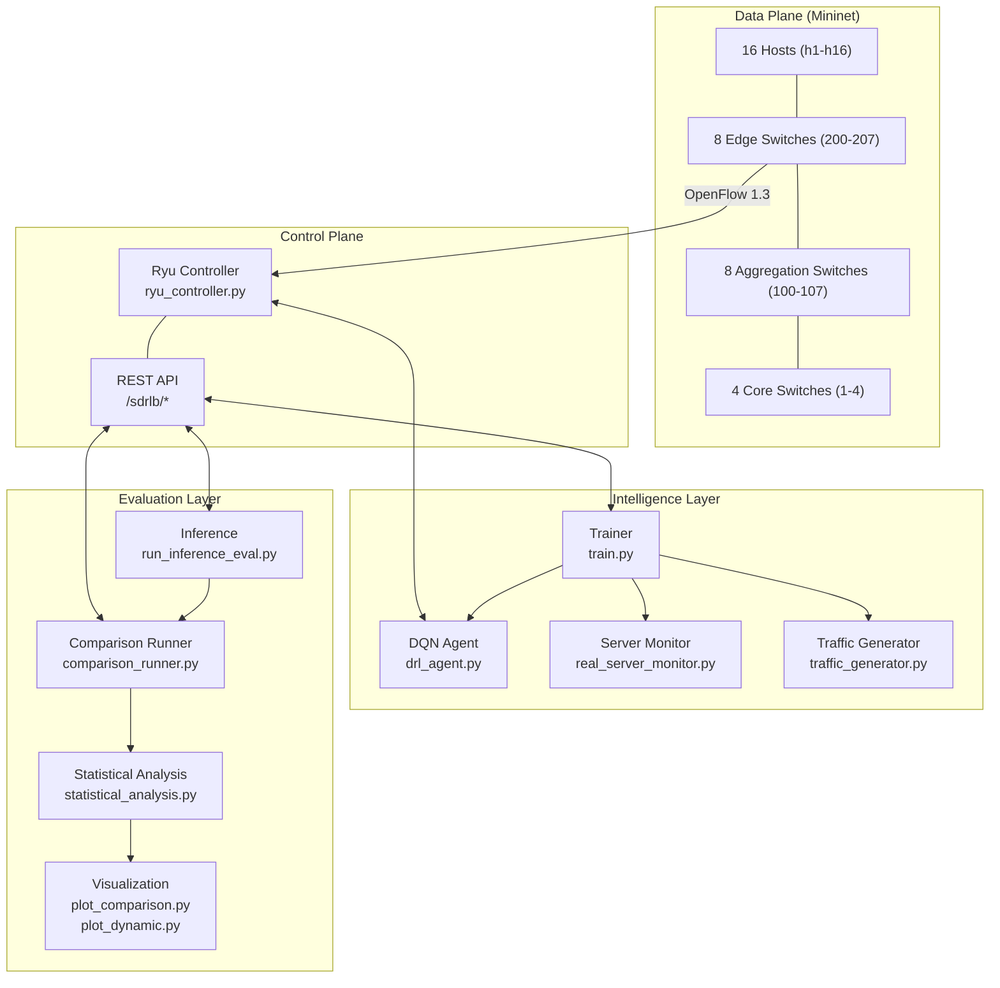
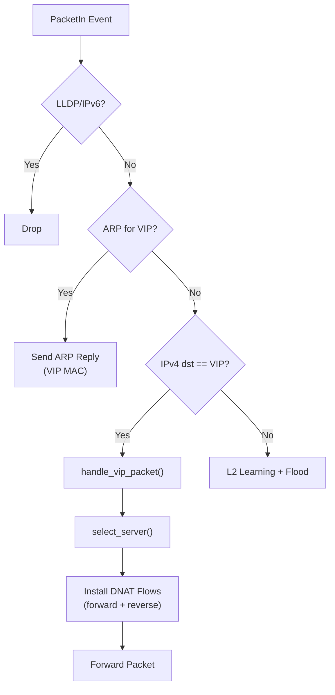
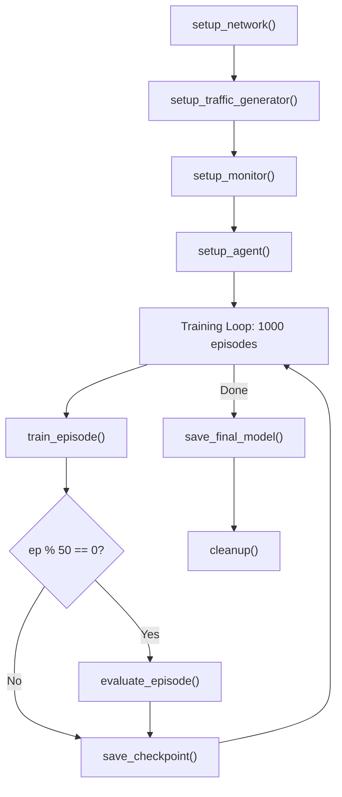

# DRL-SDN Load Balancer — Complete Project Defense Report

> **Project**: Deep Reinforcement Learning based Server Load Balancing in Software-Defined Networks
> **Architecture**: Fat-Tree (k=4) topology · Ryu SDN Controller · DQN Agent · OpenFlow 1.3

---

## Table of Contents

1. [System Architecture Overview](#1-system-architecture-overview)
2. [Stage 1: Mininet Topology Creation](#2-stage-1-mininet-topology-creation)
3. [Stage 2: Ryu SDN Controller](#3-stage-2-ryu-sdn-controller)
4. [Stage 3: DRL Agent (DQN)](#4-stage-3-drl-agent-dqn)
5. [Stage 4: Training Pipeline](#5-stage-4-training-pipeline)
6. [Stage 5: Traffic Generation & Server Monitoring](#6-stage-5-traffic-generation--server-monitoring)
7. [Stage 6: Inference & Evaluation](#7-stage-6-inference--evaluation)
8. [Stage 7: Comparative Analysis & Statistical Validation](#8-stage-7-comparative-analysis--statistical-validation)
9. [Configuration & Hyperparameters](#9-configuration--hyperparameters)
10. [File Map & Dependency Graph](#10-file-map--dependency-graph)

---

## 1. System Architecture Overview



**Key Design Decision**: The system uses a **Virtual IP (VIP) architecture** — all clients send traffic to `10.0.0.100` (VIP), and the controller performs DNAT to redirect to one of three backend servers (`h1=10.0.0.1`, `h2=10.0.0.2`, `h3=10.0.0.3`).

---

## 2. Stage 1: Mininet Topology Creation

### File: [mininet_topology.py](file:///home/andis/Documents/major-project/guna/DRL-SDN-LoadBalancer/mininet_topology.py)

#### Fat-Tree (k=4) Topology Structure

| Layer | Count | DPIDs | Naming |
|-------|-------|-------|--------|
| Core | 4 | 1–4 | `s_core1`–`s_core4` |
| Aggregation | 8 (2 per pod × 4 pods) | 100–107 | `s_agg{pod}_{idx}` |
| Edge | 8 (2 per pod × 4 pods) | 200–207 | `s_edge{pod}_{idx}` |
| Hosts | 16 (2 per edge) | — | `h1`–`h16` |

#### Key Code Details

- **Class `FatTree4(Topo)`** — builds the topology in `build(self, k=4)`:
  - Creates 4 core switches with explicit DPIDs (`f"{i+1:016x}"`)
  - Creates 4 pods, each with 2 aggregation + 2 edge switches
  - **Core↔Agg wiring**: Cores 0,1 → Agg0 in all pods; Cores 2,3 → Agg1 in all pods (standard Fat-Tree)
  - **Agg↔Edge**: Full mesh within each pod (each agg connects to both edges)
  - **Hosts**: 2 per edge, explicit IPs (`10.0.0.{id}/24`) and MACs (`00:00:00:00:00:{id:02x}`)
  - All links: `bw=100 Mbps`, `delay=1ms` via `TCLink`

- **Thread-safety monkey-patch** (lines 10–25): Overrides `Node.cmd()` and `Node.__init__()` with `threading.Lock()` to prevent race conditions during concurrent Mininet host commands.

- **`start_network()`**: Creates `RemoteController` at `127.0.0.1:6633`, forces `OpenFlow13` on every switch via `ovs-vsctl`.

### File: [setup_network.py](file:///home/andis/Documents/major-project/guna/DRL-SDN-LoadBalancer/setup_network.py)

Installs **complete bidirectional routing flows** across all 20 switches via the Ryu REST API. This is critical because the Fat-Tree topology requires explicit forwarding rules at every layer.

**5-step flow installation**:

1. **Server's own edge switch** — Direct delivery IP/ARP flows (priority 2000)
2. **Other edge switches** — Uplink to aggregation (priority 500) + return path to local hosts
3. **Aggregation switches** — Route down to server's edge OR up to core for cross-pod traffic
4. **Core switches** — Route to correct aggregation based on `CORE_TO_AGG` mapping (priority 500)
5. **VIP ARP rules** — Force `10.0.0.100` ARP to controller (`OFPP_CONTROLLER`, priority 5000)

**Design**: The 3 servers (`h1`, `h2`, `h3`) are on edge switches 200 and 201 (pod 0). All 13 remaining hosts can act as clients.

---

## 3. Stage 2: Ryu SDN Controller

### File: [ryu_controller.py](file:///home/andis/Documents/major-project/guna/DRL-SDN-LoadBalancer/ryu_controller.py) — 1342 lines

#### Class `SDNRest(app_manager.RyuApp)`

**Core Components**:

| Component | Purpose |
|-----------|---------|
| `VIRTUAL_IP = '10.0.0.100'` | VIP that all clients target |
| `VIRTUAL_MAC = 'aa:aa:aa:aa:aa:aa'` | Spoofed MAC for ARP replies |
| `server_pool` | Pre-populated dict mapping 3 server IPs to MAC/port/switch |
| `drl_agent` | Loaded DQN model for inference-time decisions |
| `current_algorithm` | Active algorithm selector (`drl`, `round_robin`, etc.) |
| `FallbackController` | Phase 4 hysteresis-based DRL→heuristic failover |

#### Packet Processing Flow



#### `handle_arp_for_vip()` (lines 256–311)
- Intercepts ARP requests for `10.0.0.100`
- Constructs ARP reply with `VIRTUAL_MAC` as the source
- Sends reply back to the requesting port — clients now believe VIP is at `aa:aa:aa:aa:aa:aa`

#### `handle_vip_packet()` (lines 630–804)
- Extracts client IP, port, protocol (TCP/UDP/ICMP)
- Calls `select_server()` to pick a backend
- Installs **bidirectional DNAT flows** at priority 4000:
  - **Forward**: `client→VIP` rewritten to `client→server_ip` (sets `eth_dst` + `ipv4_dst`)
  - **Reverse**: `server→client` rewritten to `VIP→client` (sets `eth_src` + `ipv4_src`)
- Flow timeouts: `10s idle / 20s hard` during training, `30s/60s` during inference

#### 7 Load Balancing Algorithms

| Algorithm | Method | Key Logic |
|-----------|--------|-----------|
| `drl` | `select_server_with_drl()` | Q-network greedy (ε=0.0) on 9-dim state |
| `round_robin` | `_select_round_robin()` | Cyclic counter mod N |
| `weighted_round_robin` | `_select_weighted_round_robin()` | Classic WRR with GCD weight cycling |
| `random` | `_select_random()` | `random.choice()` |
| `least_connections` | `_select_least_connections()` | Min active connections from monitor |
| `hash_based` | `_select_hash_based()` | 5-tuple hash (`src_ip:dst_ip:src_port:dst_port:proto`) |
| `ecmp` | `_select_ecmp()` | OF1.3 SELECT group table with equal-weight buckets |
| `external` | `_select_external()` | Trainer pushes action via `/set_action` REST |

#### State Vector Construction — `_build_agent_state()` (lines 589–628)

**9-dimensional state** = `[conn_share(3), load_masked(3), alive(3)]`:
- `conn_share`: Per-server connection count / total (normalized to shares summing to 1; uniform `[1/3, 1/3, 1/3]` when total ≈ 0)
- `load_masked`: `load_score × alive` (dead servers → 0.0 load)
- `alive`: Binary liveness flags from HTTP health checks

#### Phase 4: FallbackController (lines 37–87)
Hysteresis-based fallback that monitors failure events. When failure velocity exceeds `engage_threshold`, switches from DRL → least_connections. Only switches back when failures drop below `disengage_threshold`.

#### REST API Endpoints (class `SDNRestController`)

| Endpoint | Method | Purpose |
|----------|--------|---------|
| `/sdrlb/set_algorithm` | POST | Switch active algorithm |
| `/sdrlb/set_action` | POST | Receive action from external trainer |
| `/sdrlb/set_training_mode` | POST | Enable/disable session persistence |
| `/sdrlb/reset_episode` | POST | Clear VIP sessions, stats, counters |
| `/sdrlb/update_weights` | POST | Hot-swap Q-network weights (base64 encoded) |
| `/sdrlb/load_model` | POST | Load model from disk path |
| `/sdrlb/update_metrics` | POST | Accept external server metrics |
| `/sdrlb/stats` | GET | Return VIP stats + recent decisions |
| `/stats/switches` | GET | List connected datapath IDs |

---

## 4. Stage 3: DRL Agent (DQN)

### File: [drl_agent.py](file:///home/andis/Documents/major-project/guna/DRL-SDN-LoadBalancer/drl_agent.py) — 312 lines

#### Neural Network Architecture

```
Input(9) → Linear(9, 64) → ReLU → Linear(64, 3) → Q-values
```

- **Q-Network**: Maps 9-dim state to 3 Q-values (one per server)
- **Target Network**: Identical architecture, weights copied periodically for stability
- **Optimizer**: Adam with `lr=0.0003`

#### Class `DQNAgent`

| Method | Purpose |
|--------|---------|
| `act(state, epsilon)` | ε-greedy action selection; returns `(action_idx, q_values)` |
| `remember(s, a, r, s', done)` | Store transition in replay buffer |
| `train()` | Sample batch, compute TD targets, Huber loss, gradient clip (10.0), update |
| `update_target()` | Hard copy Q-net → target net |
| `save_model(path)` / `load_model(path)` | Checkpoint with q_net, target_net, optimizer, epsilon |

#### Training Step (lines 213–282)

1. Sample batch of 32 from replay buffer (uniform or PER)
2. Compute current Q: `q_net(states).gather(1, actions)`
3. Compute target Q: `rewards + γ × target_net(next_states).max(1)` (masked by `done`)
4. Loss = `SmoothL1Loss` (Huber) weighted by IS weights (for PER)
5. Gradient clipping at 10.0, Adam step
6. Decay ε: `max(0.05, ε × 0.99993)` — reaches ε_min after ~45,000 steps (~1000 episodes × 45 steps)

#### Prioritized Experience Replay (PER) — Conditional

- **`SumTree`**: Binary sum tree for O(log n) prioritized sampling
- **`PrioritizedReplayBuffer`**: TD-error based priorities, importance sampling weights annealed via β
- **Purpose**: Oversample rare failure transitions (reward = -1.0) that standard uniform sampling misses
- **Gate**: Disabled by default (`per.enabled: false`); enabled only if failure gap persists

---

## 5. Stage 4: Training Pipeline

### File: [train.py](file:///home/andis/Documents/major-project/guna/DRL-SDN-LoadBalancer/train.py) — 1096 lines

#### Class `RealLoadBalancerTrainer`

**Initialization** loads `config.yaml` and sets up:
- Action logging CSV (`action_log.csv`)
- Weight sync interval (every 10 steps)
- Ephemeral flow cookie tracking

#### Training Sequence (`train()` method, lines 924–1007)



#### Episode Lifecycle — `train_episode()` (lines 519–852)

Each episode runs for **45 seconds** with this per-step loop (1 step ≈ 1 second):

1. **Check liveness**: `is_server_alive()` via HTTP probe or Mininet curl
2. **Apply failure schedule** (if injecting): Override alive flags per the schedule
3. **Build state**: `build_state(metrics, alive)` → 9-dim vector
4. **Select action**: `agent.act(state)` with ε-greedy exploration
5. **Apply to controller**: `POST /sdrlb/set_action` with action index
6. **Wait 1 second** for traffic to flow
7. **Observe next state**: Re-check metrics and liveness
8. **Compute reward**:
   - If `alive[action] == 0`: reward = **-1.0** (hard penalty for routing to dead server)
   - Else: `action_reward = 1.0 - 2.0 × (chosen_conn - min_conn) / (max_conn - min_conn)` (range: +1.0 for least loaded, -1.0 for most loaded)
   - Plus imbalance penalty: `-0.2 × CV(connections)`
   - Clipped to [-1.0, +1.0]
9. **Store transition** + train Q-network
10. **Log** action to CSV

#### Failure Injection System (Phase 3) — 5 Modes

Activated after episode 80 with 45% probability per episode:

| Mode | Probability | Behavior |
|------|------------|----------|
| **Total Outage** | 5% | All 3 servers down for 3–8 steps |
| **Cascading** | 20% | Server A fails, then B fails later |
| **Flapping** | 15% | Server fails-recovers-fails (2–3 cycles) |
| **Multi-Server** | 30% | 2 servers down simultaneously |
| **Single** | 30% (remainder) | 1 server down for variable duration |

**Variable duration**: 5–20 steps, randomized start position within episode.

**Critical Design**: Episodes are **never aborted** on failure — the agent continues running and the -1.0 penalty for dead-server routing teaches it directly (Phase 3B fix).

#### Traffic Patterns (7 diverse scenarios, cycled per episode)

| Pattern | Rate |
|---------|------|
| Constant (moderate) | 100 rps |
| Bursty (standard) | 50 base → 400 burst |
| Incremental (ramp) | 50 → 300 |
| Sinusoidal (wave) | 100 ± 150 |
| Constant (high stress) | 300 rps |
| Constant (idle) | 30 rps |
| Bursty (extreme) | 20 base → 600 burst |

---

## 6. Stage 5: Traffic Generation & Server Monitoring

### File: [traffic_generator.py](file:///home/andis/Documents/major-project/guna/DRL-SDN-LoadBalancer/traffic_generator.py) — 463 lines

#### Traffic Pattern Classes

Each implements `get_rate(elapsed_time) → float`:
- **`ConstantTraffic`**: Fixed rate
- **`BurstyTraffic`**: `burst_rate` for `burst_duration` seconds every `burst_interval` seconds
- **`IncrementalTraffic`**: Linear interpolation from `start_rate` to `end_rate`
- **`SinusoidalTraffic`**: `base + amplitude × sin(2π × t / period)`

#### `TrafficGenerator` Class

- **Clients**: All hosts EXCEPT servers (`h4`–`h16`, 13 clients)
- **Servers**: `h1`, `h2`, `h3` running Python `http.server` on port 8000
- **`send_batch()`**: Uses Apache Bench (`ab`) for high-concurrency HTTP load
- **`start_http_servers()`**: Creates index.html per host, starts `python3 -m http.server 8000`

### File: [real_server_monitor.py](file:///home/andis/Documents/major-project/guna/DRL-SDN-LoadBalancer/real_server_monitor.py) — 630 lines

#### `ServerMonitor` Class

Background thread polls every 2s per server:

| Metric | Collection Method | Normalization |
|--------|------------------|---------------|
| CPU | `ps aux \| grep http.server \| awk '{sum+=$3}'` | % / 100 → [0,1] |
| Memory | `ps aux \| awk '{sum+=$4}'` | % / 100 → [0,1] |
| RTT | `curl -w "%{time_total}" --head` from rotating clients h4/h5/h6 | Seconds |
| Connections | `netstat -an \| grep ':8000' \| grep -v LISTEN \| wc -l` | Integer |
| **Load Score** | `0.6×CPU + 0.2×Memory + 0.2×min(conns/1000, 1.0)` | [0, 1] |

---

## 7. Stage 6: Inference & Evaluation

### File: [inference.py](file:///home/andis/Documents/major-project/guna/DRL-SDN-LoadBalancer/inference.py) — 110 lines

Standalone script that loads trained model from `models/final/dqn_final.pth`, serializes weights to base64, and pushes via `POST /sdrlb/update_weights`. Controller then runs with trained policy (ε=0.0).

### File: [run_inference_eval.py](file:///home/andis/Documents/major-project/guna/DRL-SDN-LoadBalancer/run_inference_eval.py) — 382 lines

**7-step automated evaluation pipeline**:

1. Push trained model to controller
2. Start Mininet network
3. Install routing flows
4. Set controller to DRL inference mode
5. Start HTTP servers + traffic generator (80 rps constant for 120s)
6. Run traffic loop + metric collection (per-second)
7. Compute summary: Jain's fairness, latency, stabilization time

**Stabilization Detection**: First time step where fairness stays ≥ 0.85 for 15 consecutive seconds.

**Output**: `logs/inference_eval_<timestamp>.json` + optional matplotlib plot.

### File: [evaluate_baseline.py](file:///home/andis/Documents/major-project/guna/DRL-SDN-LoadBalancer/evaluate_baseline.py) — 302 lines

#### `InstrumentedTrafficGenerator`

Extends `TrafficGenerator` to parse Apache Bench output for latency stats:
- **Mean latency**: Regex on `"Time per request: X [ms] (mean)"`
- **P95 latency**: Regex on `"95% X"`
- **Variance**: From `"Total: min mean[+/-sd]"` → std² 

---

## 8. Stage 7: Comparative Analysis & Statistical Validation

### File: [comparison_runner.py](file:///home/andis/Documents/major-project/guna/DRL-SDN-LoadBalancer/comparison_runner.py) — 704 lines

Benchmarks DRL against 6 baselines across **static + 4 dynamic scenarios**.

#### Algorithms Tested

`round_robin`, `weighted_round_robin`, `random`, `least_connections`, `hash_based`, `ecmp`, `drl`

#### Per-Trial Metric Collection (every 1 second)

| Metric | Source |
|--------|--------|
| Throughput | Controller `/stats` delta |
| Avg/P95 RTT | Server monitor |
| Jain's Fairness | Server selections distribution |
| Max Imbalance | max(conns) - min(conns) |
| Decision Latency | 1000× tight `GET /stats` loop (µs) |
| Per-server connections | h1/h2/h3 active connections |

#### Dynamic Scenarios (in [scenarios/](file:///home/andis/Documents/major-project/guna/DRL-SDN-LoadBalancer/scenarios/))

| Scenario | File | Duration | Events |
|----------|------|----------|--------|
| **Failure Recovery** | `failure_recovery.py` | 180s | h1 down@30s→up@90s, h2 down@120s→up@150s |
| **Heterogeneous** | `heterogeneous_capacity.py` | 120s | h1 throttled to 512kbit (0.5× capacity) |
| **Bursty Saturation** | `bursty_saturation.py` | 120s | 15s on / 15s off burst cycles |
| **Combined Stress** | `combined_stress.py` | 180s | Failure + throttle + burst simultaneously |

Each scenario uses `BaseScenario.run()` which handles the traffic loop, metric collection, and calls subclass hooks (`on_step()`, `compute_metrics()`).

**Key scenario utilities**: `kill_http_server()`, `revive_http_server()`, `add_tc_throttle()` (Linux `tc` qdisc for bandwidth limiting).

### File: [statistical_analysis.py](file:///home/andis/Documents/major-project/guna/DRL-SDN-LoadBalancer/statistical_analysis.py) — 342 lines

**Rigorous hypothesis testing** (DRL vs each baseline, per metric):

1. **Normality check**: Shapiro-Wilk test (α=0.05)
2. **Test selection**: If both groups normal → Welch's t-test; otherwise → Mann-Whitney U
3. **Effect size**: Cohen's d (pooled std)
4. **Output**: Per-comparison p-value, significance flag, DRL-better flag

**Metrics tested per scenario**:
- Static: `fairness_index` (↑), `avg_rtt` (↓), `throughput` (↑)
- Failure: `time_to_adapt` (↓), `failed_request_count` (↓), `fairness_among_alive` (↑)
- Heterogeneous: `h1_traffic_share` (↓), `avg_rtt_weighted` (↓), `throughput_loss` (↓)
- Bursty: `p95_rtt_burst` (↓), `queue_saturation_events` (↓), `recovery_time` (↓)
- Combined: `stress_failed_rate` (↓), `stress_fairness_alive` (↑), `stress_avg_rtt_ms` (↓)

### Visualization Scripts

#### [plot_comparison.py](file:///home/andis/Documents/major-project/guna/DRL-SDN-LoadBalancer/plot_comparison.py) — 6 publication-quality figures:
1. Fairness vs Time (with stabilization markers)
2. Latency vs Load (with confidence bands)
3. Throughput Bar Chart
4. Connection Distribution (stacked area per algorithm)
5. Decision Overhead (horizontal bar, log scale)
6. Summary Heatmap (normalized red→green)

#### [plot_dynamic.py](file:///home/andis/Documents/major-project/guna/DRL-SDN-LoadBalancer/plot_dynamic.py) — Dynamic scenario plots:
1. Failure recovery (dead-server routing + fairness)
2. Heterogeneous capacity (traffic share + RTT)
3. Bursty saturation (latency under bursts)
4. Combined stress (composite 4-panel)
5. Updated comprehensive heatmap

---

## 9. Configuration & Hyperparameters

### File: [config.yaml](file:///home/andis/Documents/major-project/guna/DRL-SDN-LoadBalancer/config.yaml)

| Category | Parameter | Value | Rationale |
|----------|-----------|-------|-----------|
| **DRL** | `state_dim` | 9 | 3 servers × 3 features |
| | `action_dim` | 3 | Select h1, h2, or h3 |
| | `hidden_dim` | 64 | Single hidden layer |
| | `epsilon_decay` | 0.99993 | Reaches 0.05 after ~45K steps |
| | `learning_rate` | 0.0003 | Reduced for stability |
| **Training** | `episodes` | 1000 | Extended for robust policy |
| | `episode_duration` | 45s | Deeper learning per episode |
| | `batch_size` | 32 | Standard DQN batch |
| | `memory_size` | 50,000 | 5× larger for 1000 episodes |
| | `gamma` | 0.99 | High discount for future rewards |
| **Failure Injection** | `start_episode` | 80 | After basic policy converges |
| | `probability` | 0.45 | 45% of post-80 episodes |
| | `multi_server_prob` | 0.30 | 30% chance 2 servers die |
| | `cascading_prob` | 0.20 | Staggered kill pattern |
| **Reward** | `alpha` | 1.0 | Latency weight |
| | `beta` | 0.5 | Variance weight |

---

## 10. File Map & Dependency Graph

### Complete File Inventory

| File | Lines | Role |
|------|-------|------|
| `mininet_topology.py` | 139 | Fat-Tree k=4 topology definition |
| `setup_network.py` | 490 | Static routing flow installation |
| `ryu_controller.py` | 1342 | SDN controller + VIP LB + REST API |
| `drl_agent.py` | 312 | DQN + PER + target network |
| `train.py` | 1096 | Full training pipeline with failure injection |
| `traffic_generator.py` | 463 | 4 traffic patterns + HTTP server management |
| `real_server_monitor.py` | 630 | Real CPU/mem/RTT/connection monitoring |
| `inference.py` | 110 | Push trained weights to controller |
| `run_inference_eval.py` | 382 | End-to-end inference evaluation |
| `evaluate_baseline.py` | 302 | Baseline algorithm evaluation harness |
| `comparison_runner.py` | 704 | 7-algorithm × N-trial benchmark runner |
| `statistical_analysis.py` | 342 | Shapiro-Wilk + t-test/Mann-Whitney |
| `plot_comparison.py` | 340 | 6 static comparison plots |
| `plot_dynamic.py` | 403 | 5 dynamic scenario plots |
| `visualize_inference.py` | 137 | Inference metrics 6-panel dashboard |
| `scenarios/base_scenario.py` | 312 | Base class for dynamic scenarios |
| `scenarios/failure_recovery.py` | 79 | Server kill/revive at fixed times |
| `scenarios/heterogeneous_capacity.py` | ~80 | tc throttle for capacity mismatch |
| `scenarios/bursty_saturation.py` | ~80 | Burst cycle stress test |
| `scenarios/combined_stress.py` | ~80 | All stressors simultaneously |
| `utils/metrics.py` | 233 | Reward functions (real + simulated) |
| `utils/metrics_collector.py` | 162 | Jain's fairness, link throughput, server aggregates |
| `config.yaml` | 103 | All hyperparameters and settings |

### Execution Order for Full Pipeline

```
# Terminal 1: Start Ryu Controller
ryu-manager --observe-links ryu_controller.py

# Terminal 2: Train the DRL Agent (runs Mininet internally)
sudo python3 train.py --config config.yaml

# Terminal 3: Inference Evaluation
sudo python3 run_inference_eval.py --duration 120

# Terminal 4: Comparative Analysis (30 trials per algorithm)
sudo python3 comparison_runner.py --trials 10 --scenario all --output-dir comparison_results_v4

# Terminal 5: Statistical Analysis + Plots
python3 statistical_analysis.py comparison_results_v4
python3 plot_comparison.py --input-dir comparison_results_v4/static
python3 plot_dynamic.py --base-dir comparison_results_v4
```

### Key Data Flow Summary

```
state[9] = [conn_share₁, conn_share₂, conn_share₃,
            load₁×alive₁, load₂×alive₂, load₃×alive₃,
            alive₁, alive₂, alive₃]

action ∈ {0=h1, 1=h2, 2=h3}

reward = clip(action_reward - 0.2×CV, -1, +1)
  where action_reward = 1 - 2×(chosen_conn - min_conn)/(max_conn - min_conn)
  EXCEPTION: reward = -1.0 if alive[action] == 0
```

> **Total codebase**: ~6,800 lines of Python across 25+ files implementing a complete DRL-based SDN load balancing system with training, inference, benchmarking, and statistical validation.
